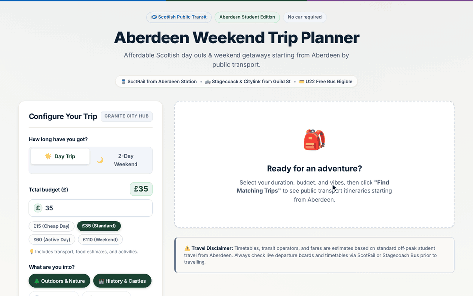

# Build with Antigravity

This is the reference doc for the GDGoC Aberdeen Google Antigravity workshop.

By the end of the workshop you'll have a working **Weekend Trip Planner**: a small web app where you enter a budget, how long you've got and what you're into, and it puts together a cheap trip around Scotland starting from Aberdeen. You'll build all of it inside Antigravity, and you won't need any API keys.

You won't write much code yourself. The point of the workshop is learning how to *direct* an agent: give it context, let it ask you questions, review its plan, approve (or refuse) what it wants to run, and check its work.



---

## Contents

1. [Pre-start checklist](#pre-start-checklist)
2. [Antigravity overview](#antigravity-overview)
3. [The build](#the-build)
   - [Stage 1: Open the project and give the agent context](#stage-1-open-the-project-and-give-the-agent-context)
   - [Stage 2: Let the agent question you](#stage-2-let-the-agent-question-you)
   - [Stage 3: Review the plan](#stage-3-review-the-plan)
   - [Stage 4: Scaffold the app](#stage-4-scaffold-the-app)
   - [Stage 5: Build the trip planner](#stage-5-build-the-trip-planner)
   - [Stage 6: Let the agent test it in a browser](#stage-6-let-the-agent-test-it-in-a-browser)
   - [Stage 7: Run agents in parallel](#stage-7-run-agents-in-parallel)
4. [Free build and stretch goals](#free-build-and-stretch-goals)
5. [Working well with agents](#working-well-with-agents)
6. [Links](#links)

### Agenda

| Time  | What |
|-------|------|
| 14:00 | Arrival and setup check |
| 14:15 | Intro and live demo |
| 14:30 | Guided build (stages 1-7) |
| 16:00 | Free build |
| 16:30 | Show and tell (optional) |
| 16:45 | Wrap-up, feedback, photo |

## Pre-start checklist

Use the first 15 minutes to run through this checklist. If anything's not working, put your hand up and one of us will come over.

- **Antigravity is installed.** Download it from [antigravity.google/download](https://antigravity.google/download). We're using the Antigravity desktop app today, not the Antigravity IDE.
- **You're signed in with a personal Google account** (an @gmail.com address), not your university account.
- **Git is installed.** Run `git --version` in a terminal. If you don't have it, that's fine, the agent can install it for you in Stage 1.

A note on quota: free accounts get a weekly allowance of agent usage. Today's build fits comfortably inside it, but avoid running lots of big `/goal` tasks to avoid running out before completing the app.

## Antigravity overview

Antigravity is Google's agent-first development platform. Instead of opening files and typing code, you work in conversations with an agent that can read your project, edit files, run terminal commands and drive a browser. Your job is to steer it and review what it does.

### Key terms

| Term | What it means |
|------|---------------|
| **Project** | One or more folders the agent is allowed to work in, plus their settings and permissions. Today it's just the workshop repo. |
| **Conversation** | A chat thread inside a project. Start a fresh one when you switch to a different task. |
| **Artifact** | Something the agent produces for you to review: an implementation plan, a task list, code diffs, screenshots, a browser recording, a walkthrough. You can comment on artifacts to steer the agent. |
| **Permission prompt** | A card asking you to approve an action, such as running a terminal command or opening a URL. Read it before you click. |
| **Slash command** | Type `/` in the chat box to see them. They change how the agent works on your next message (e.g. `/grill-me`, `/plan`, `/goal`, `/browser`). |
| **Subagent** | A second agent the main one starts to handle a focused piece of work in parallel. |
| **Skill** | A folder with a `SKILL.md` file that teaches the agent how to do a specific job. Lives in `.agents/skills/` in your project. |

### Handy shortcuts

| Action | Shortcut |
|--------|-----------------|
| Focus the chat box | `Ctrl+L`|
| Search files | `Ctrl+P` |
| Switch conversation | `Ctrl+K` |
| Attach a file as context | type `@` then the file name |
| Open slash commands | type `/` |

### Slash commands

| Command | What it does |
|---------|--------------|
| `/grill-me` | The agent interviews you about what you want before it plans anything |
| `/plan` | Researches the code and writes a reviewable implementation plan |
| `/browser` | Starts a browser subagent that can open pages, click around and take screenshots |
| `/goal` | Keeps working until the task is done without stopping to check in |
| `/btw` | Ask a quick side question without interrupting the agent |
| `/learn` | Turns corrections you've made into rules or skills it remembers |
| `/schedule` | Runs an instruction later, once or on a repeat |

The full list is in the [slash commands docs](https://antigravity.google/docs/slash-commands/).

## The build

Each stage below has:

- **Feature:** the Antigravity feature we're showing
- **Prompt:** what to paste into the chat (feel free to alter this)
- **What you should see**

Don't worry if your app ends up looking different from the one on screen. Agents don't produce the same output twice, so if you don't get an exact match that is okay.

### Stage 1: Open the project and give the agent context

**Feature:** projects, conversations, `@` file context

1. Clone the workshop repo somewhere you can find it:

   ```powershell
   git clone https://github.com/Konrad-Rejman/GDGoC-Aberdeen-Google-Antigravity-Workshop.git
   ```

   No Git? Open Antigravity, create a project on an empty folder and ask the agent: *"Install git if it isn't already installed, then clone https://github.com/Konrad-Rejman/GDGoC-Aberdeen-Google-Antigravity-Workshop.git into this folder."*

2. In Antigravity, click the **folder icon with a +** in the left sidebar, choose **New Project**, add the folder you just cloned and click **Create**.
3. Start a new conversation. If it asks, choose **Local mode** so the agent works directly in your folder.
4. Press on the text input field (`Ctrl+L`) and send:

```text
Read @BRIEF.md and tell me, in three short bullet points, what we're building and who it's for. Don't create or change any files yet.
```

**What you should see:** a short summary of the app. The `@BRIEF.md` mention attached the file to your message, so the agent didn't have to go looking for it. Get into the habit of pointing the agent at the files that matter.

---

### Stage 2: Let the agent question you

**Feature:** `/grill-me`

Most bad AI output comes from vague instructions. `/grill-me` flips things round: the agent asks *you* the questions it needs answered before it can plan properly.

```text
/grill-me We're building the Weekend Trip Planner described in @BRIEF.md. Interview me about what the app should do before we plan anything. Keep it to the important decisions. When we're done, write what we agreed to SPEC.md. Don't write any code.
```

The agent will show you questions, often with options you can click. Answer them as yourself. If you want to match the demo, these are the answers we gave on screen:

- **Inputs:** trip length (day trip or 2-day overnight), budget in £, and interests (Outdoors, History, Coastal, Food)
- **Where trips come from:** a curated list of realistic public transport trips from Aberdeen (e.g. Stonehaven and Dunnottar, Royal Deeside, Dundee, Cruden Bay), filtered by what the user picks
- **Budget too low:** suggest free or cheap things to do in Aberdeen itself (e.g. Footdee, Old Aberdeen and Seaton Park, Duthie Park)
- **How the plan looks:** a timeline that shows the operator and type of transport rather than specific bus numbers (these can change), with estimated costs and a note that prices may vary
- **Under-22 free bus travel:** yes, add an "Under 22 / Free Bus Pass" toggle that sets bus fares to £0
- **When several trips match:** show them in order of relevance, best match first

**What you should see:** a series of questions, then a new `SPEC.md` in your project. Open it and check it says what you meant. If it doesn't, tell the agent what's wrong now. Fixing the spec is much cheaper than fixing the code later.

---

### Stage 3: Review the plan

**Feature:** artifacts (implementation plan, task list) and inline comments

```text
/plan Create an implementation plan for the app in @SPEC.md. Keep it to a simple web app that runs on my machine, with no accounts, no external APIs and no API keys. Include a task list. Wait for my review before writing any code.
```

The plan opens as an **artifact** in the review pane. Read through it and leave comments on anything you'd change by selecting the text and adding a comment, like you would in Google Docs. A few examples:

- *"Use plain HTML/CSS/JS for the frontend, no framework."*
- *"Prices should be shown in £."*
- *"Drop the map feature, it's out of scope."*

Send your comments. The agent revises the plan, and you can go round again until you're happy. Once you're happy, approve the plan and the agent turns it into a **task list** that it ticks off as it works.

**What you should see:** an implementation plan and task list artifact. Nothing in your folder should have changed yet apart from `SPEC.md`.

---

### Stage 4: Scaffold the app

**Feature:** permission prompts

```text
The plan is approved. Start on the task list: set up the project structure and install any dependencies. Stop before writing the trip-planning logic, and don't start a dev server yet.
```

The agent will now want to run commands, for example installing packages or creating folders. Each one shows up as a **permission prompt**. Read it before you approve it.

Things that are normal today:

- installing packages (`npm install ...`, `pip install ...`, `uv add ...`)
- creating files and folders inside the project
- running `git` commands in the project

Things to stop and ask about:

- anything that deletes files outside the project folder
- downloading and running a script from a URL you don't recognise
- anything that uploads your files to a website
- anything asking for administrator rights that you didn't expect

You can always deny a command and tell the agent why. It'll find another way.

Every terminal command needs your approval, so expect a fair few prompts during this stage.

Permission settings live in **Settings > General > Permission Settings**, and you can also override them per project, so a project with stricter rules doesn't affect your others. Leave them as they are for today.

**What you should see:** a folder structure, installed dependencies, and the first tasks ticked off in the task list. Click into the **diffs** to see exactly what changed.

---

### Stage 5: Build the trip planner

**Feature:** the agent editing across several files at once

```text
Build the trip-planning part of the app. Create a data file of ~20 places that are easy to reach from Aberdeen by public transport. For each one, include a rough return fare, the travel time and a handful of things to do, each tagged with an interest and a rough cost. For overnight trips, include a rough cost for a hostel or budget B&B. Then write the logic that picks a destination and activities to fit the user's budget, number of days and interests, and connect it to the form. Label every price as an estimate.
```

**What you should see:** a new data file, the planning logic and changes to the page, all in one go. Look through the diffs to see how the pieces connect.

Open the data file too. It's plain text, so you can add your own favourite places or fix a price yourself, or ask the agent to. The prices are the agent's estimates rather than live fares, so check before you book anything.

---

### Stage 6: Let the agent test it in a browser

**Feature:** browser agent and the walkthrough artifact

```text
/browser Start the dev server and open the app. Plan a trip with a £120 budget, 2 days, interests: outdoors and food. Check the plan shows up with costs and a total that's under budget. Try one broken input too (e.g. a budget of £0) and check the app handles it. Record what you did and give me a walkthrough with screenshots.
```

Antigravity starts a separate browser that the agent controls. You'll see it open pages, type into the form and click buttons. You may get permission prompts the first time it opens a URL.

**What you should see:** a **walkthrough** artifact with screenshots or a recording of what the agent tried and what happened. If it found a bug, ask it to fix it and run the check again.

Now open the app in your own browser and try it yourself. The agent can tell you if something is broken, but only you can tell if it's any good.

---

### Stage 7: Run agents in parallel

**Feature:** subagents and parallel tasks

```text
Use two subagents working in parallel:
1. One writes tests for the trip-planning logic (budgets, number of days, interests, and a budget too small to go anywhere) and runs them until they pass. It should only touch test files.
2. One restyles the frontend so it looks like a clean, modern travel app with a Scottish feel. It should only touch frontend files.
Tell me when both are done and summarise what each changed.
```

Telling each subagent which files it owns stops them treading on each other.

**What you should see:** both agents' progress at the same time. They show up in the task panel above the chat box. Click one to see what it's doing. If one says **Needs Attention**, it's waiting on you, usually to approve a command, so click it and respond. When they finish you'll get a summary, a test run and a better-looking app.

## Free build and stretch goals

Congratulations, you've got a working app. Pick something from below, or make the app your own.

### Feature ideas

- A packing list based on the weather forecast for the destination
- "Surprise me": the user only enters a budget
- Accessibility filter (step-free routes, accessible venues)
- Save and share a trip as a link
- Let users add their own places to the list from the app

### Try `/goal`

`/goal` keeps the agent going until a task is fully done, without stopping to ask you things. It's good for features that are clearly defined. It also uses more quota, so give it a tight brief.

```text
/goal Add a "Surprise me" button that plans a trip using only the budget. Add a test for it, and finish when all tests pass and the browser check shows the feature working.
```

### Add a skill

Skills are reusable instructions the agent picks up automatically when they're relevant. Ask the agent to write one for you:

```text
Create a skill at .agents/skills/trip-style/SKILL.md called trip-style. Its description should say to use it whenever adding or editing destinations, activities or how trips are shown. The rules: prices always in GBP with a £ sign, prefer public transport routes from Aberdeen (ScotRail, Stagecoach, CalMac), mention one free activity per day, keep activity descriptions under 25 words.
```

Open the `SKILL.md` it creates to see what a skill looks like: a short header with a name and description, then the instructions. Then ask the agent to add three new destinations and see if it follows your skill. You can also call a skill directly by typing `/trip-style`.

### Deploy to Cloud Run

Deploying needs a Google Cloud project with billing turned on. If you have one:

```text
Deploy this app to Cloud Run. Walk me through any gcloud setup I need first.
```

## Working well with agents

A few habits that will save you time today and after.

- **Spec first, code second.** Use `/grill-me` and `/plan` before any code gets written. If something's wrong, fix the spec or the plan, not the code.
- **Give context on purpose.** Use `@` to point at the files that matter rather than hoping the agent finds them.
- **Say what not to do.** "Don't start a server", "only touch frontend files" and "don't write code yet" help as much as saying what to do.
- **One task per conversation.** When you move on to something unrelated, start a new conversation. Long, messy threads give worse results.
- **Read before you approve.** Permission prompts and diffs exist so you stay in control. Skim them, at the very least.
- **Check the work yourself.** The browser agent and tests catch broken things. They don't catch ugly, confusing or wrong-for-the-user.
- **Be clear when you comment.** "This is wrong" gives the agent nothing to work with. "Costs should include the return journey" does.
- **Mind your quota.** Use a faster model for small edits and questions, and save the bigger models and `/goal` for planning and larger features.

## Links

- [Antigravity docs](https://antigravity.google/docs)
- [Slash commands](https://antigravity.google/docs/slash-commands/)
- [Skills](https://antigravity.google/docs/skills)
- [Permissions](https://antigravity.google/docs/permissions)
- [Introducing Google Antigravity 2.0](https://antigravity.google/blog/introducing-google-antigravity-2)

---

**Feedback:** A short survey will be sent out by email after this event to participants, please tell us what worked and what didn't, it helps shape future events.

**Next event:** Building Multimodal Web Apps with Gemini API, NK1, New Kings, Friday Oct 9th 5PM. 

Follow GDGoC Aberdeen on [gdg.community.dev](https://gdg.community.dev/gdg-on-campus-university-of-aberdeen-aberdeen-scotland/) so you hear about future events.
